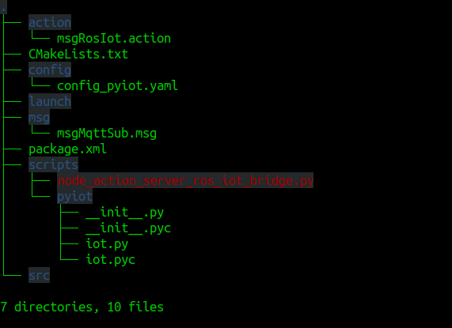
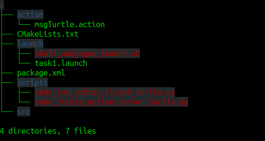

## Problem Statement
The primary objective of this task is to make a generic ROS Package which can act as a bridge between ROS and IoT and can be used in any ROS Application.
This package which you are going to develop in this task will be used in future tasks also.
In this task your team has to submit following two ROS Packages.
      -  pkg_ros_iot_bridge
      -  pkg_task1

### pkg_ros_iot_bridge



#### node_action_server_ros_iot_bridge.py
This package should consist a action server node_action_server_ros_iot_bridge.py which should be able to accept Goals from Action Clients. On receiving appropriate Goal the Action Server, Should be able to push as many data points on a Google Sheet at once. For eg. this function should be able to push any number of data on to google sheet passed to it as arguments.

HINT: The function which is going to handle this task can be a Variadic Function.
Should be able to publish on any MQTT Topic.
Should be able to subscribe to any MQTT Topic and publish the message from MQTT subscription to a ROS Topic /ros_iot_bridge/mqtt/sub using msgMqttSub.msg message file.

-    /eyrc/<unique_id>/ros_to_iot : Use this MQTT Topic to publish data from ROS Node. MQTT client should then subscribe to this MQTT topic.

-    /eyrc/<unique_id>/iot_to_ros: Use this MQTT Topic to send message from MQTT Client to any ROS Node. MQTT Client should publish on this topic and the node_ros_iot_bridge_action_server.py Action Server should listen to this MQTT Topic and publish the message coming from this MQTT Topic on the ROS Topic /ros_iot_bridge/mqtt/sub.

-    Use action name /action_ros_iot.

NOTE: You can refer the ROS package pkg_iot_ros_bridge provided in Learn -> ROS Basics -> ROS Actions section to create this package.

#### iot.py
This python module should do all the necessary IoT Tasks (MQTT & HTTP).
node_ros_iot_bridge_action_server.py should import this module for IoT tasks.

#### config_pyiot.yaml
This should contain all the necessary configurations like,
```
 config_pyiot:
      mqtt:
        server_url: 
        server_port: 
        topic_sub: 
        topic_pub: 
        qos: 
        sub_cb_ros_topic:    # ROS nodes can listed to this topic to receive data from MQTT Subscription
      google_apps:
        spread_sheet_id: 	# Spreadsheet Id/Webapp Id
```
-    If your Webapp URL is this: https://script.google.com/macros/s/AKfycbw850dk4moVgebU2GGe0PUQUvvg8jTpSjBQCawJt3_13vgujLk/exec

-    then your Webapp ID/Spreadsheet ID will be this: AKfycbw850dk4moVgebU2GGe0PUQUvvg8jTpSjBQCawJt3_13vgujLk

### pkg_task1



This package should make the turtle in turtlesim_node trace a hexagon using Simple Actions and interact with ROS-IoT Bridge ROS Node node_iot_ros_bridge_action_server.py in the pkg_ros_iot_bridge ROS package to send and receive messages from the internet.

#### node_simple_action_server_turtle.py
This node should receive Goals to move the turtle from Action Client.
Refer to Learn -> ROS Basics -> ROS Actions -> Simple Actions -> Example #1: Simple Action Server.
Use action name /action_turtle.

#### node_iot_action_client_turtle.py
This node should send Goals to node_simple_action_server_turtle.py in order to make the turtle trace a Hexagon of side length 2 Units.
When MQTT Client send the message start on MQTT Topic /eyrc/<unique_id>/iot_to_ros then only the turtle should start tracing a hexagon.
A goal should instruct the turtle to trace one side of the hexagon at a time. For eg. there are six sides in a hexagon, so the first goal would be to trace first side of the Hexagon. On completion of this Goal the client should receive a Result which should contain the final x, y and theta of the turtle.
This final x, y and theta of the turtle coming as Result from the server should be published on the MQTT Topic /eyrc/<unique_id>/ros_to_iot by the node_iot_action_client_turtle.py ROS Node and the MQTT client should subscribe to this.
This final x, y and theta of the turtle coming as Result from the server should also be pushed to a Google Spreadsheet created by you.

HINT: A ROS Node can act as both Simple Action Client and Action Client.


#### shell_webpages_launch.sh
This shell script should launch the following URLs in any web-browser.

HiveMQ Webclient (MQTT Client): http://www.hivemq.com/demos/websocket-client/

Your Google Spreadsheet in which you are going to push x, y and theta of the turtle.


#### task1.launch
This launch file should,
- Load parameters at pkg_actions_ros_iot_bridge/config/config_pyiot.yaml into the parameter server.
- Launch the following ROS Nodes,
    - node_action_server_ros_iot_bridge.py
    - turtlesim_node
    - node_simple_action_server_turtle.py
    - node_iot_action_client_turtle.py
    - Launch the shell_webpages_launch.sh.

### Procedure
Once both the packages are ready then launch task1.launch in pkg_task1 using roslaunch.
The launch file should start all the necessary ROS Nodes.
- node_action_server_ros_iot_bridge.py
- turtlesim_node
- node_simple_action_server_turtle.py
- node_iot_action_client_turtle.py

It should also open HiveMQ Webclient and your Google Spreadsheet in two separate windows in any browser.
Arrange all the windows such that HiveMQ Webclient, your Google Spreadsheet and turtlesim_node are visible. Refer to Expected Output Section to get some idea.
Once everything in place, the use HiveMQ MQTT Client to send the message start on MQTT Topic /eyrc/<unique_id>/iot_to_ros.
Once this message is received by node_iot_action_client_turtle.py it should send goals to node_simple_action_server_turtle.py to trace a hexagon.

